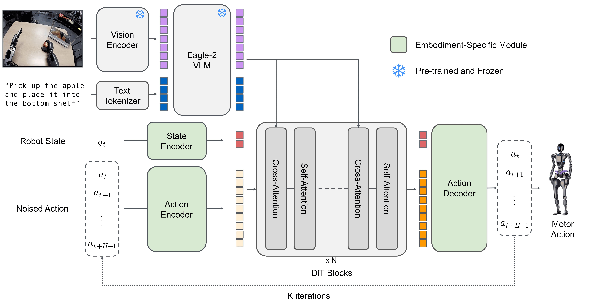
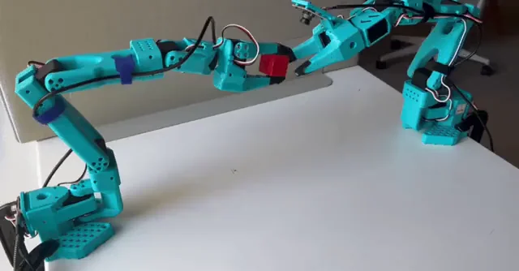

<p align="center">
  
</p>

<div align="center">

[](https://github.com/huggingface/lerobot/actions/workflows/latest_deps_tests.yml?query=branch%3Amain)
[](https://github.com/huggingface/lerobot/actions/workflows/docker_publish.yml?query=branch%3Amain)
[](https://www.python.org/downloads/)
[](https://github.com/huggingface/lerobot/blob/main/LICENSE)
[](https://pypi.org/project/lerobot/)
[](https://pypi.org/project/lerobot/)
[](https://github.com/huggingface/lerobot/blob/main/CODE_OF_CONDUCT.md)
[](https://discord.gg/q8Dzzpym3f)

</div>

**LeRobot** 旨在为真实世界的机器人应用提供基于 PyTorch 的模型、数据集和工具。我们的目标是降低准入门槛，让每个人都能为共享数据集和预训练模型做出贡献并从中受益。

🤗 硬件无关的 Python 原生接口，标准化控制各种平台，从低成本机械臂（SO-100）到人形机器人。

🤗 标准化、可扩展的 LeRobotDataset 格式（Parquet + MP4 或图像），托管在 Hugging Face Hub 上，实现海量机器人数据集的高效存储、流式传输和可视化。

🤗 已被证明可迁移到真实世界的最先进策略，可直接用于训练和部署。

🤗 全面支持开源生态系统，推动物理 AI 的民主化。

## 快速开始

LeRobot 可以直接从 PyPI 安装。

```bash
pip install lerobot
lerobot-info
```

> [!IMPORTANT]
> 详细的安装指南，请参阅[安装文档](https://huggingface.co/docs/lerobot/installation)。

## 机器人与控制

<div align="center">
  
</div>

LeRobot 提供了统一的 `Robot` 类接口，将控制逻辑与硬件细节解耦。它支持广泛的机器人和遥操作设备。

```python
from lerobot.robots.myrobot import MyRobot

# 连接到机器人
robot = MyRobot(config=...)
robot.connect()

# 读取观测并发送动作
obs = robot.get_observation()
action = model.select_action(obs)
robot.send_action(action)
```

**支持的硬件：** SO100、LeKiwi、Koch、HopeJR、OMX、EarthRover、Reachy2、游戏手柄、键盘、手机、OpenARM、Unitree G1。

虽然这些设备已原生集成到 LeRobot 代码库中，但该库设计为可扩展的。您可以轻松实现 Robot 接口，以便为您自己的定制机器人使用 LeRobot 的数据收集、训练和可视化工具。

有关详细的硬件设置指南，请参阅[硬件文档](https://huggingface.co/docs/lerobot/integrate_hardware)。

## LeRobot 数据集

为了解决机器人学中的数据碎片化问题，我们使用 **LeRobotDataset** 格式。

- **结构：** 同步的 MP4 视频（或图像）用于视觉，Parquet 文件用于状态/动作数据。
- **HF Hub 集成：** 在 [Hugging Face Hub](https://huggingface.co/lerobot) 上探索数千个机器人数据集。
- **工具：** 无缝删除片段、按索引/比例分割、添加/删除特征以及合并多个数据集。

```python
from lerobot.datasets.lerobot_dataset import LeRobotDataset

# 从 Hub 加载数据集
dataset = LeRobotDataset("lerobot/aloha_mobile_cabinet")

# 访问数据（自动处理视频解码）
episode_index=0
print(f"{dataset[episode_index]['action'].shape=}\n")
```

在 [LeRobotDataset 文档](https://huggingface.co/docs/lerobot/lerobot-dataset-v3)中了解更多信息。

## 最先进的模型

LeRobot 使用纯 PyTorch 实现最先进的策略，涵盖模仿学习、强化学习和视觉-语言-动作（VLA）模型，更多模型即将推出。它还为您提供了工具来监测和检查训练过程。

<p align="center">
  
</p>

训练策略就像运行脚本配置一样简单：

```bash
lerobot-train \
  --policy=act \
  --dataset.repo_id=lerobot/aloha_mobile_cabinet
```

| 类别         | 模型                                                                                                                                                                                                                    |
| ------------ | ----------------------------------------------------------------------------------------------------------------------------------------------------------------------------------------------------------------------- |
| **模仿学习** | [ACT](./docs/source/policy_act_README.md)、[Diffusion](./docs/source/policy_diffusion_README.md)、[VQ-BeT](./docs/source/policy_vqbet_README.md)、[Multitask DiT Policy](./docs/source/policy_multi_task_dit_README.md) |
| **强化学习** | [HIL-SERL](./docs/source/hilserl.mdx)、[TDMPC](./docs/source/policy_tdmpc_README.md) 和 QC-FQL（即将推出）                                                                                                              |
| **VLA 模型** | [Pi0Fast](./docs/source/pi0fast.mdx)、[Pi0.5](./docs/source/pi05.mdx)、[GR00T N1.5](./docs/source/policy_groot_README.md)、[SmolVLA](./docs/source/policy_smolvla_README.md)、[XVLA](./docs/source/xvla.mdx)            |

与硬件类似，您可以轻松实现自己的策略并利用 LeRobot 的数据收集、训练和可视化工具，并将您的模型分享到 HF Hub。

有关详细的策略设置指南，请参阅[策略文档](https://huggingface.co/docs/lerobot/bring_your_own_policies)。有关每个策略的 GPU/RAM 要求和预期训练时间，请参阅[计算硬件指南](https://huggingface.co/docs/lerobot/hardware_guide)。

## 推理与评估

使用统一的评估脚本在仿真或真实硬件上评估您的策略。LeRobot 支持标准基准测试，如 **LIBERO**、**MetaWorld** 等，更多即将推出。

```bash
# 在 LIBERO 基准测试上评估策略
lerobot-eval \
  --policy.path=lerobot/pi0_libero_finetuned \
  --env.type=libero \
  --env.task=libero_object \
  --eval.n_episodes=10
```

通过遵循 [EnvHub 文档](https://huggingface.co/docs/lerobot/envhub)，了解如何实现您自己的仿真环境或基准测试并从 HF Hub 分发它。

## 资源

- **[文档](https://huggingface.co/docs/lerobot/index)：** 教程和 API 的完整指南。
- **[中文教程：LeRobot+SO-ARM101中文教程-同济子豪兄](https://zihao-ai.feishu.cn/wiki/space/7589642043471924447)** 组装、遥操作、数据集、训练、部署的详细文档。已由 Seed Studio 和 5 个全球黑客松参与者验证。
- **[Discord](https://discord.gg/q8Dzzpym3f)：** 加入 `LeRobot` 服务器与社区讨论。
- **[X](https://x.com/LeRobotHF)：** 在 X 上关注我们，了解最新动态。
- **[机器人学习教程](https://huggingface.co/spaces/lerobot/robot-learning-tutorial)：** 使用 LeRobot 学习机器人学习的免费实践课程。

## 引用

如果您在项目中使用 LeRobot，请引用 GitHub 仓库以感谢持续的开发和贡献者：

```bibtex
@misc{cadene2024lerobot,
    author = {Cadene, Remi and Alibert, Simon and Soare, Alexander and Gallouedec, Quentin and Zouitine, Adil and Palma, Steven and Kooijmans, Pepijn and Aractingi, Michel and Shukor, Mustafa and Aubakirova, Dana and Russi, Martino and Capuano, Francesco and Pascal, Caroline and Choghari, Jade and Moss, Jess and Wolf, Thomas},
    title = {LeRobot: State-of-the-art Machine Learning for Real-World Robotics in Pytorch},
    howpublished = "\url{https://github.com/huggingface/lerobot}",
    year = {2024}
}
```

如果您引用我们的研究或学术论文，请同时引用我们的 ICLR 出版物：

<details>
<summary><b>ICLR 2026 论文</b></summary>

```bibtex
@inproceedings{cadenelerobot,
  title={LeRobot: An Open-Source Library for End-to-End Robot Learning},
  author={Cadene, Remi and Alibert, Simon and Capuano, Francesco and Aractingi, Michel and Zouitine, Adil and Kooijmans, Pepijn and Choghari, Jade and Russi, Martino and Pascal, Caroline and Palma, Steven and Shukor, Mustafa and Moss, Jess and Soare, Alexander and Aubakirova, Dana and Lhoest, Quentin and Gallou\'edec, Quentin and Wolf, Thomas},
  booktitle={The Fourteenth International Conference on Learning Representations},
  year={2026},
  url={https://arxiv.org/abs/2602.22818}
}
```

</details>

## 贡献

我们欢迎社区中每个人的贡献！要开始，请阅读我们的 [CONTRIBUTING.md](https://github.com/huggingface/lerobot/blob/main/CONTRIBUTING.md) 指南。无论您是添加新功能、改进文档还是修复错误，您的帮助和反馈都是无价的。我们对开源机器人技术的未来感到非常兴奋，迫不及待地想与您一起开发下一步的内容——感谢您的支持！

<p align="center">
  
</p>

<div align="center">
<sub>Built by the <a href="https://huggingface.co/lerobot">LeRobot</a> team at <a href="https://huggingface.co">Hugging Face</a> with ❤️</sub>
</div>
